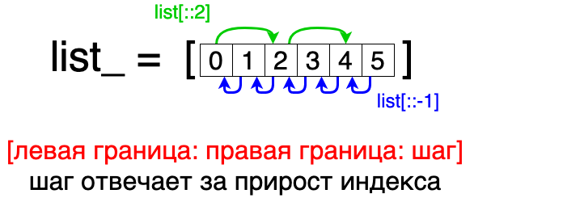

При задании границ слайсирования,  
можно передать третье необязательное число,  
который задает шаг, с которым необходимо  
перебирать элементы, заключенные в заданных границах.  
По умолчанию шаг равен 1.

