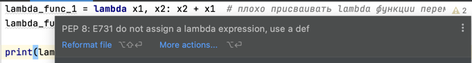

Lambda функции в большинстве своем предназначены для выполнения  
каких-либо одноразовых действий.
```python
# эти две функции выполняют одно и тоже складывают два числа
def my_function(x1, x2):  # Обычная функция
    return x2 + x1

lambda x1, x2: x2 + x1  # Lambda функция
```

Поэтому плохо присваивать lambda функции каким-либо переменным.  
Обратите внимание, что среда разработки ругается, но ошибки в этом нет.

